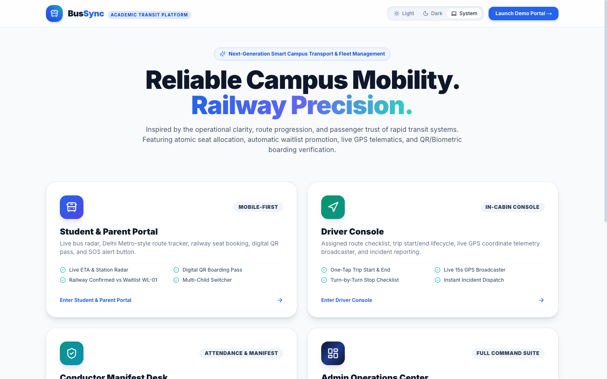
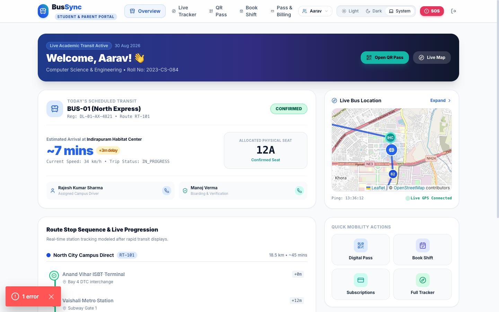
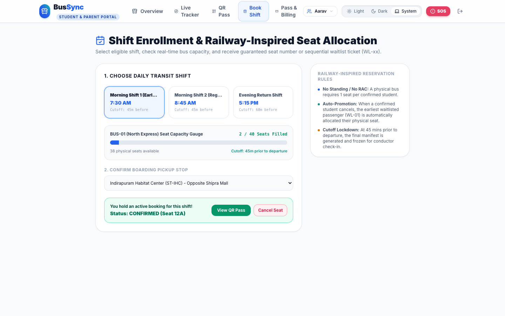
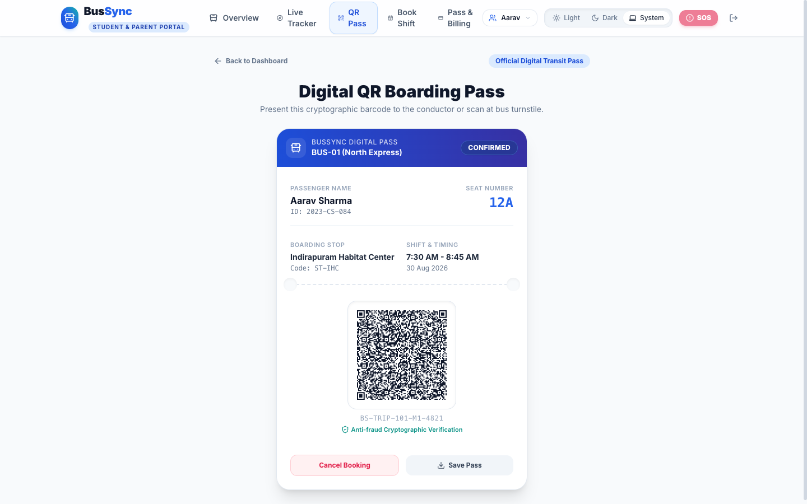
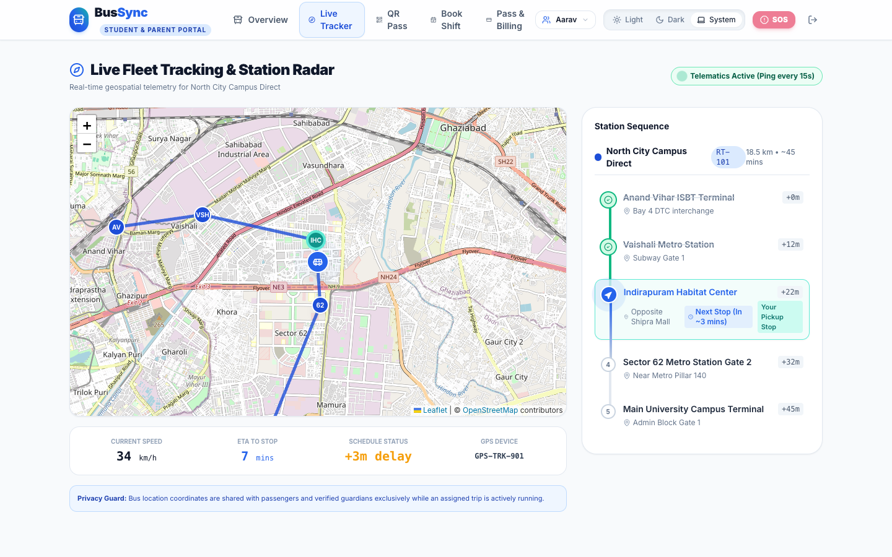
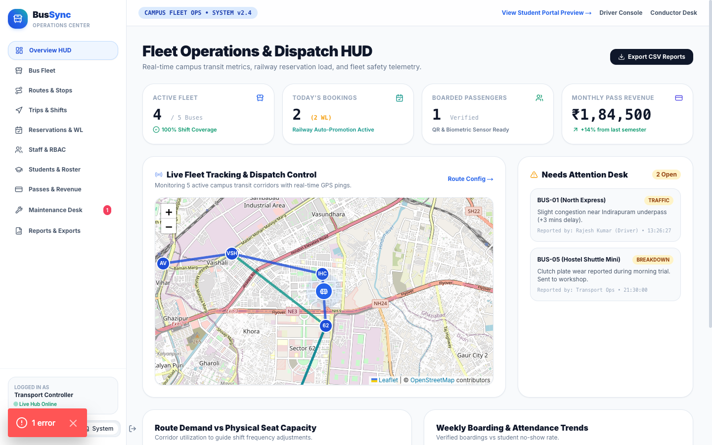
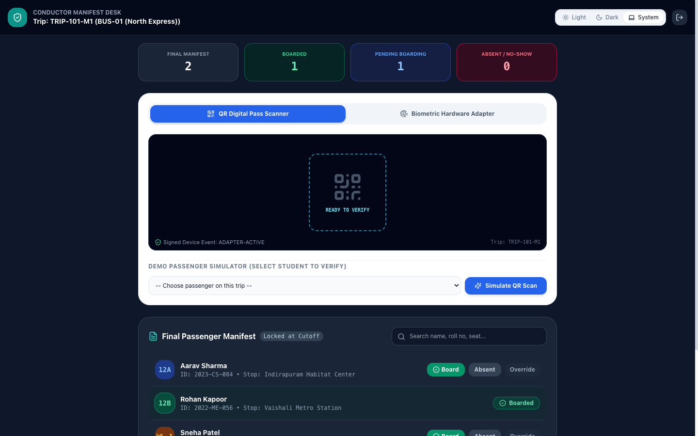
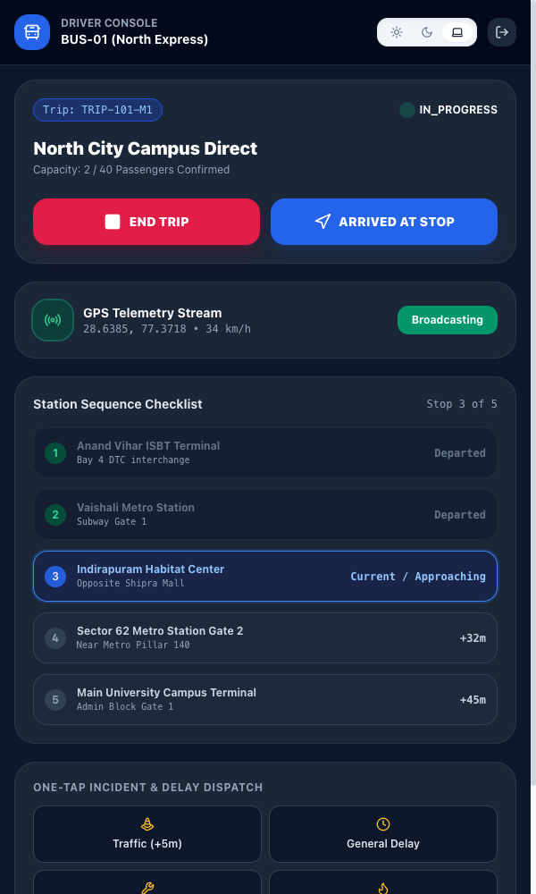

# 🚌 BusSync — Smart Campus Transport and Bus Management System

> **Production-Quality Full-Stack Academic Project**  
> Built with **Next.js (App Router), TypeScript, Tailwind CSS, shadcn/ui patterns, Supabase PostgreSQL, and Leaflet**.  
> Inspired by the operational clarity, route progression, and passenger safety of modern rapid transit systems.

---

## 📸 Application Interface & Visual Tour

### 1. Unified Gateway & Role Portal Launchers


### 2. Student & Parent Live Transit Radar (`/portal`)


### 3. Railway Seat Reservation & Waitlist Engine (`/portal/booking`)


### 4. Anti-Fraud Cryptographic Digital Boarding Pass (`/portal/pass`)


### 5. Full-Screen Live GPS Radar & Metro Station Progression (`/portal/tracker`)


### 6. Admin Operations Control HUD & Analytics (`/admin`)


### 7. Conductor Manifest Desk & Biometric Scanner (`/staff/conductor`)


### 8. Driver In-Cabin Console (`/staff/driver`)
<p align="center">
  
</p>

---

## 🌟 Key Highlights & Innovations

1. **Railway-Inspired Reservation Engine**
   - **Fixed Seat Allocation**: Every confirmed student receives an assigned physical seat number (e.g. `12A`, `14B`).
   - **No Standing / No RAC**: Buses require strictly 1 physical seat per confirmed passenger for high safety.
   - **Sequential Waitlist Queue**: When capacity is reached, students receive numbered waitlist tickets (`WL-01`, `WL-02`...).
   - **Automatic FIFO Promotion**: When a confirmed passenger cancels prior to the cutoff deadline, the earliest waitlisted passenger is automatically promoted to `CONFIRMED` and inherits the freed seat.
   - **Final Manifest Lock**: At the configurable cutoff time (e.g., 45 mins prior to departure), the trip manifest is frozen for conductor check-in.

2. **Role-Based Panels**
   - **Student & Parent Portal (`/portal`)**: Live bus radar, Delhi Metro-style linear station checklist, ETA countdown ("Arrives in 7 mins"), anti-fraud QR digital pass, multi-child switcher, and prominent Emergency SOS trigger.
   - **Driver Console (`/staff/driver`)**: Mobile-first cabin console with 1-tap Trip Start/End, real-time 15s GPS telematics broadcast simulation, turn-by-turn stop checklist, and instant incident dispatcher (Traffic, Breakdown, Fuel, Delay).
   - **Conductor Console (`/staff/conductor`)**: Final passenger manifest, built-in camera QR scanner, and certified Biometric Hardware Adapter simulation with zero raw biometric storage.
   - **Admin Operations Center (`/admin`)**: Live Operations-Control map HUD, interactive Route Builder with geofencing, staff RBAC matrix, student roster, subscription billing, vehicle issue desk, and CSV reports.

3. **Biometric Hardware Adapter Compliance**
   - No raw fingerprint images or biometric templates are stored in PostgreSQL.
   - Device conducts on-chip verification and returns signed event tokens (`SIG-FP-AES256-VALID-7729`).
   - Conductor manual override is available as a fallback and requires an auditable justification reason.

4. **Complete Light / Dark Theme Engine**
   - System preference detection via `prefers-color-scheme`.
   - Light, Dark, and System mode selector with local persistence.
   - Accessible WCAG contrast ratios across all cards, maps, charts, and digital passes.

---

## 🚀 Technology Stack

- **Frontend**: Next.js 14 (App Router), React 18, TypeScript, Framer Motion
- **Styling**: Tailwind CSS, Lucide Icons, Custom Transit Design System
- **Database & Security**: Supabase PostgreSQL, Row Level Security (RLS), PL/pgSQL Atomic Functions, Triggers
- **Mapping & Geospatial**: Leaflet, OpenStreetMap, Dynamic Haversine ETA calculation
- **Visualizations**: Recharts for route demand, seat occupancy, and attendance trends
- **Testing**: Vitest for unit & reservation engine tests

---

## 📂 Project Structure

```
Major Project/
├── .env.example                               # Supabase & App environment variables template
├── vitest.config.ts                           # Vitest testing configuration
├── supabase/
│   ├── migrations/
│   │   └── 20260830_initial_bussync_schema.sql # 26+ tables, RLS policies & atomic PL/pgSQL functions
│   └── seed.sql                               # Realistic demo seed data
├── docs/
│   └── screenshots/                           # Captured high-res interface screenshots
├── src/
│   ├── app/
│   │   ├── page.tsx                           # Universal Gateway & Role Launcher
│   │   ├── layout.tsx                         # Root Layout with ThemeProvider & Fonts
│   │   ├── globals.css                        # CSS Design tokens & Leaflet map styling
│   │   ├── portal/                            # Student & Parent Mobile/Desktop Portal
│   │   │   ├── page.tsx                       # Live Overview, Today's Bus & ETA card
│   │   │   ├── tracker/page.tsx               # Full-screen GPS radar & station line
│   │   │   ├── pass/page.tsx                  # Digital QR Boarding Pass
│   │   │   ├── booking/page.tsx               # Railway shift booking & waitlist
│   │   │   └── payments/page.tsx              # Subscription passes & invoice receipts
│   │   ├── staff/
│   │   │   ├── driver/page.tsx                # Driver In-Cabin Console
│   │   │   └── conductor/page.tsx             # Conductor Manifest & Attendance Scanner
│   │   └── admin/
│   │       ├── page.tsx                       # Operations Center Overview & Analytics
│   │       ├── buses/page.tsx                 # Fleet & GPS device ID management
│   │       ├── routes/page.tsx                # Interactive split-view route builder
│   │       ├── trips/page.tsx                 # Trip scheduler & manifest locking
│   │       ├── reservations/page.tsx          # Railway reservation & waitlist desk
│   │       ├── staff/page.tsx                 # Staff RBAC matrix & permissions
│   │       ├── students/page.tsx              # Student & guardian directory
│   │       ├── billing/page.tsx               # Subscriptions & revenue ledger
│   │       ├── maintenance/page.tsx           # Vehicle issue & repair logs
│   │       └── reports/page.tsx               # Compliance reports & CSV download generator
│   ├── components/
│   │   ├── common/                            # ThemeProvider, ThemeToggle, SOSModal
│   │   ├── maps/                              # BusSyncMap (Leaflet with custom markers)
│   │   ├── ticket/                            # BoardingPassCard (Notched ticket with QR)
│   │   ├── scanner/                           # BiometricAndQRScanner hardware interface
│   │   └── ui/                                # StationLineProgress & transit components
│   └── lib/
│       ├── types.ts                           # TypeScript interfaces
│       ├── store.ts                           # Reactive local store with mock database
│       ├── reservation-engine.ts              # Railway reservation logic & promotion
│       ├── eta-calculator.ts                  # Haversine distance & dynamic ETA math
│       └── utils.ts                           # Utility helpers
```

---

## 🛠️ Quick Start & Local Setup

### 1. Install Dependencies
```bash
npm install
```

### 2. Run Tests
```bash
npm test
```

### 3. Start Development Server
```bash
npm run dev
```
Open [http://localhost:3000](http://localhost:3000) to view the portal.

---

## 🗄️ Supabase PostgreSQL Setup

1. Create a new project at [Supabase](https://supabase.com).
2. Navigate to **SQL Editor** and run the contents of [`supabase/migrations/20260830_initial_bussync_schema.sql`](./supabase/migrations/20260830_initial_bussync_schema.sql).
3. Run the seed script in [`supabase/seed.sql`](./supabase/seed.sql).
4. Copy your **Project URL** and **Anon Key** from Project Settings > API into `.env.local`:
   ```env
   NEXT_PUBLIC_SUPABASE_URL=https://your-ref.supabase.co
   NEXT_PUBLIC_SUPABASE_ANON_KEY=your-anon-key
   SUPABASE_SERVICE_ROLE_KEY=your-service-role-key
   ```

---

## 🚢 Deploying to Vercel

1. Push this repository to GitHub.
2. Go to [Vercel](https://vercel.com) and click **Add New Project**.
3. Import the repository.
4. Add the environment variables from `.env.example`.
5. Click **Deploy**.

---

## 🧪 Viva / Project Demonstration Walkthrough

1. **Landing Gateway (`/`)**: Tour the role overview and transit architecture highlights.
2. **Student Dashboard (`/portal`)**: Check Today's Bus (`BUS-01`), live ETA (`~7 mins`), Metro station checklist, and parent child switcher.
3. **QR Digital Pass (`/portal/pass`)**: View anti-fraud ticket with assigned physical seat `12A`.
4. **Shift Booking (`/portal/booking`)**: View bus capacity gauge (38/40 filled). Reserve a seat or join waitlist (`WL-01`). Cancel a confirmed seat to watch the system auto-promote the waitlisted passenger in real-time!
5. **Emergency SOS**: Click the prominent red **SOS** button in top bar to trigger high-priority alert with live coordinates.
6. **Driver Console (`/staff/driver`)**: Click **Start Trip**, toggle live 15s GPS broadcasting, and report a traffic incident.
7. **Conductor Console (`/staff/conductor`)**: Simulate camera QR scan or Biometric Hardware Adapter verification; inspect the frozen final passenger manifest.
8. **Admin Operations Center (`/admin`)**: Review fleet KPIs, route demand charts, interactive Leaflet route builder, vehicle issue desk, and export CSV compliance reports.
